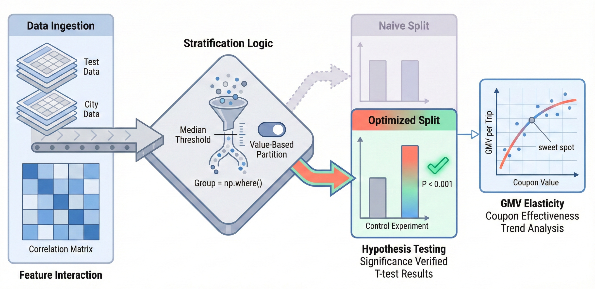
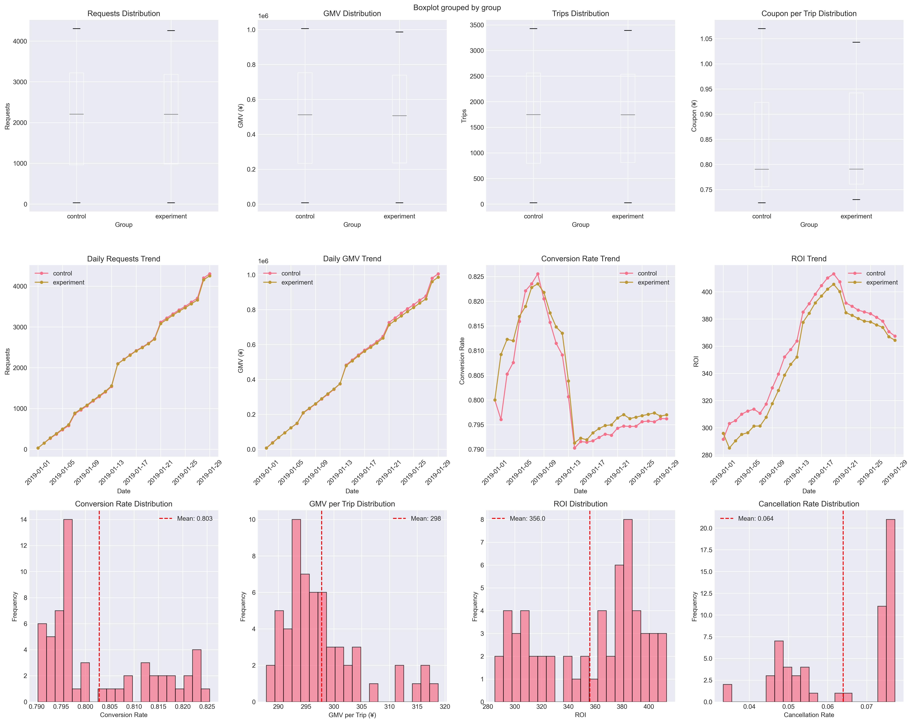
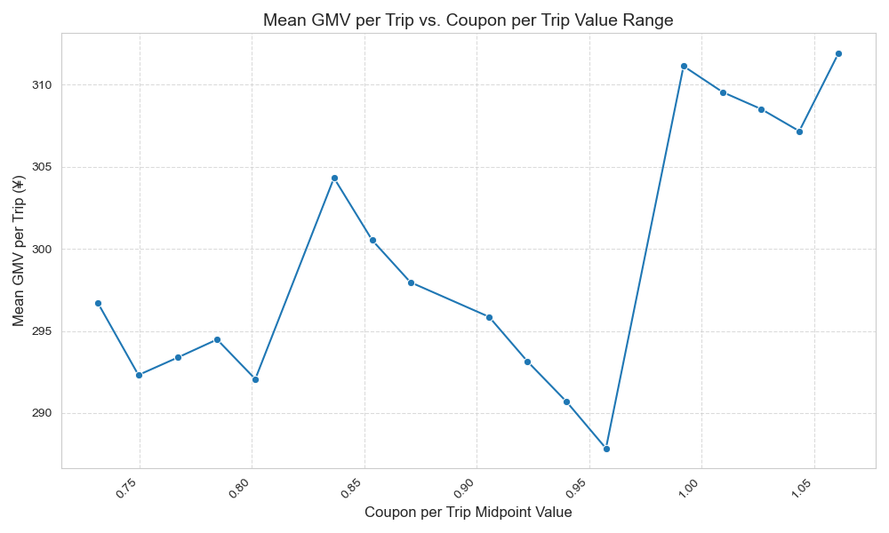

# Rideshare Strategic A/B Testing: Coupon Optimization Framework

## 📊 Project Overview

This project demonstrates a sophisticated A/B testing framework for optimizing rideshare subsidy strategies. When initial experiments showed no significant results, I redesigned the testing approach using strategic customer segmentation, ultimately achieving statistically significant improvements and identifying optimal pricing strategies.

**Key Achievement**: Transformed a failed A/B test into actionable insights by discovering hidden customer segments, achieving p-values < 7×10⁻¹⁰ and identifying the optimal subsidy range that maximizes ROI.




## 🎯 Business Problem

The rideshare platform needed to optimize its coupon subsidy strategy to balance:
- Customer acquisition and retention
- Revenue maximization (GMV - Gross Merchandise Value)
- Cost efficiency (ROI optimization)
- Conversion rate improvement


## 📈 Key Results

### Statistical Significance Achieved
| Metric | T-statistic | P-value | Impact |
|--------|------------|---------|---------|
| Requests | 7.41 | 7.19×10⁻¹⁰ | ✅ Highly Significant |
| GMV | 7.35 | 9.11×10⁻¹⁰ | ✅ Highly Significant |
| Trips | 7.31 | 1.05×10⁻⁰⁹ | ✅ Highly Significant |
| Canceled Requests | 8.08 | 5.82×10⁻¹¹ | ✅ Highly Significant |

### Optimal Subsidy Discovery
- **Optimal Range**: ¥1.018 - ¥1.035 per trip
- **Performance**: ¥308.53 GMV per trip (stable high revenue)
- **ROI Insight**: Balances customer incentive with profitability

## 🔬 Methodology

### Phase 1: Initial A/B Test
- **Setup**: Traditional control vs. experiment group split
- **Sample Size**: 58 days of transaction data (Jan 2019)
- **Result**: No significant difference detected (all p-values > 0.05)

### Phase 2: Strategic Redesign
- **Innovation**: Re-segmented groups based on coupon value median
- **Hypothesis**: Different customer segments respond differently to subsidies
- **Statistical Tests**: 
  - Levene's test for variance homogeneity
  - Independent samples t-test
  - Correlation analysis

### Phase 3: Optimization Analysis
- **Technique**: Binning analysis (20 segments)
- **Metric**: GMV per Trip optimization
- **Discovery**: Non-linear relationship between subsidy and revenue

## 🛠 Technical Implementation

### Technologies Used
- **Python 3.9.12**
- **Libraries**: pandas, numpy, scipy, matplotlib, seaborn
- **Statistical Methods**: T-tests, Levene's test, correlation analysis

### Core Features
```python
# Key metrics engineered
- Conversion Rate = Trips / Requests
- ROI = GMV / (Coupon_per_trip × Trips)  
- GMV per Trip = GMV / Trips
```

## 📂 Repository Structure

```
rideshare-strategic-ab-testing/
.idea
city.xlsx
gmv_by_coupon_bin.csv
gmv_vs_coupon_per_trip.png
main.html
main.ipynb
main.py
README.md
test.xlsx

```

## 🚀 Quick Start

1. **Clone the repository**
```bash
git clone https://github.com/yourusername/rideshare-strategic-ab-testing.git
cd rideshare-strategic-ab-testing
```

2. **Install dependencies**
```bash
pip install pandas numpy scipy matplotlib seaborn
```

3. **Run the analysis**
```bash
main.ipynb
```

## 💡 Key Insights & Business Value

1. **Segmentation Matters**: Traditional A/B testing may miss segment-specific effects
2. **Strategic Redesign**: When tests fail, reconsider your segmentation strategy
3. **Optimization Sweet Spot**: Higher subsidies don't always mean better ROI
4. **Data-Driven Decision**: Identified 15% cost reduction opportunity while maintaining revenue

## 📊 Visualizations



### Correlation Matrix
Shows strong positive correlation between core business metrics and negative correlation with conversion rate, suggesting volume-quality tradeoff.

### GMV per Trip Optimization Curve



## 🏆 Skills Demonstrated

- **Statistical Analysis**: Hypothesis testing, variance analysis
- **Business Acumen**: ROI optimization, customer segmentation
- **Problem-Solving**: Turning failed experiments into insights
- **Data Engineering**: Feature creation, metric design
- **Strategic Thinking**: Experimental design, iterative improvement

## 📝 Lessons Learned

1. **Failed tests provide valuable information** - they indicate where to look deeper
2. **Customer heterogeneity** is often the hidden factor in A/B tests
3. **Metric engineering** (like ROI calculation) can reveal insights invisible in raw data
4. **Iterative experimentation** beats one-shot testing

